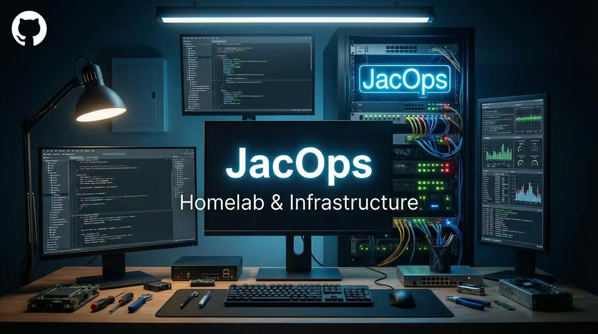

# JacOps Homelab

🇬🇧 [English](README.md) | 🇳🇱 Nederlands

> Security-first homelab van JacOps. Portfolio en runbook in één.

## Over deze repo

Deze repository beschrijft het ontwerp en de bouw van een gesegmenteerd homelab-netwerk. Het dient twee doelen. Eerst als portfoliostuk dat laat zien hoe ik netwerksecurity, segmentatie en remote access aanpak. Daarnaast als persoonlijk runbook zodat ik dezelfde opzet vanaf nul kan herbouwen wanneer dat nodig is.

Het homelab draait op een Proxmox cluster achter een UniFi Cloud Gateway, met zone-based firewalling, VLAN segmentatie en WireGuard voor remote access. Elke ontwerpkeuze staat gedocumenteerd inclusief de redenering erachter.

Deze eerste release dekt de netwerklaag volledig. Documentatie van het Proxmox cluster en de self-hosted services volgt in latere iteraties.

## Navigatie

| Sectie | Beschrijving |
|--------|--------------|
| [network/](network/) | Architectuur, VLANs, zone-based firewall, WireGuard VPN, hardening |
| [proxmox/](proxmox/) | Cluster setup, hardening, backups, storage, networking, VM-hygiene, monitoring |
| [hardware/](hardware/) | Fysieke apparatuur: YubiKey hardware 2FA |
| [services/](services/) | Self-hosted services: n8n, Uptime Kuma, ntfy |
| [docs/](docs/) | Ontwerpbeslissingen en geleerde lessen |

## Tech stack

- **Gateway:** UniFi Cloud Gateway Ultra
- **Switching:** UniFi USW-Lite-8-PoE
- **WiFi:** UniFi U6 Pro
- **Hypervisor:** Proxmox VE 9.x cluster (2 nodes)
- **VPN:** WireGuard met dynamic DNS
- **Monitoring:** Uptime Kuma met self-hosted ntfy voor alerts
- **Backups:** Proxmox Backup Server met dedup en verify
- **Automatisering:** n8n
- **Security tooling:** Wazuh (gepland na eJPT)

## Status

| Onderdeel | Staat |
|-----------|-------|
| Netwerkarchitectuur gedocumenteerd | Klaar |
| VLAN-segmentatie gedocumenteerd | Klaar |
| Zone-based firewall gedocumenteerd | Klaar |
| WireGuard remote access gedocumenteerd | Klaar |
| Cybersecurity hardening gedocumenteerd | Klaar |
| Ontwerpbeslissingen gedocumenteerd | Klaar |
| Geleerde lessen gedocumenteerd | Klaar |
| Proxmox cluster setup gedocumenteerd | Klaar |
| Proxmox hardening gedocumenteerd | Klaar |
| Proxmox Backup Server gedocumenteerd | Klaar |
| Proxmox storage gedocumenteerd | Klaar |
| Proxmox networking gedocumenteerd | Klaar |
| Proxmox VM en container hygiene gedocumenteerd | Klaar |
| Proxmox monitoring gedocumenteerd | Klaar |
| YubiKey hardware 2FA gedocumenteerd | Klaar |
| n8n service gedocumenteerd | Klaar |
| Uptime Kuma service gedocumenteerd | Klaar |
| ntfy service gedocumenteerd | Klaar |

## Over JacOps

JacOps is het freelance merk van [Nicky Jacobs](https://www.linkedin.com/in/N-O-Jacobs), SOC analyst en security engineer uit Nederland. Focusgebieden zijn detection engineering, netwerksecurity en security automation.

## Licentie

[MIT](LICENSE)
