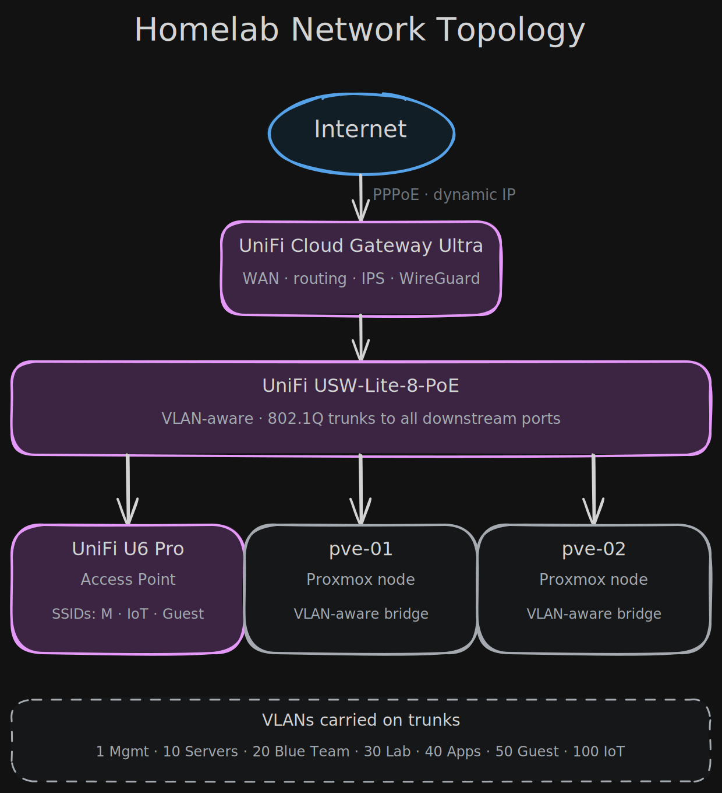
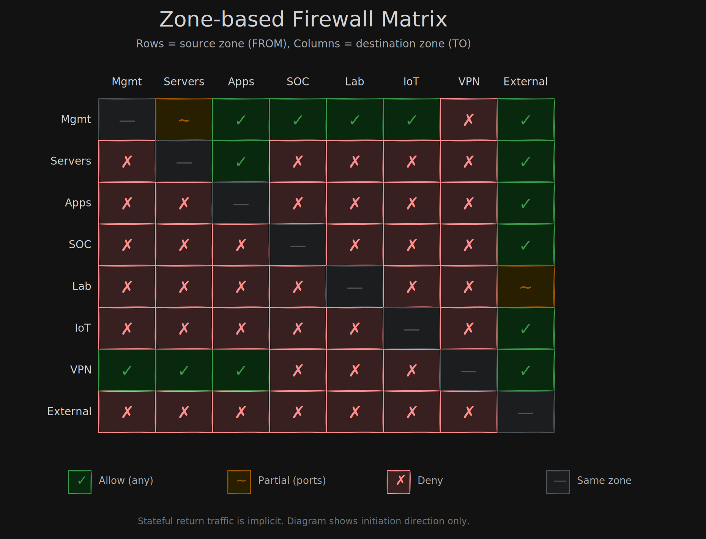
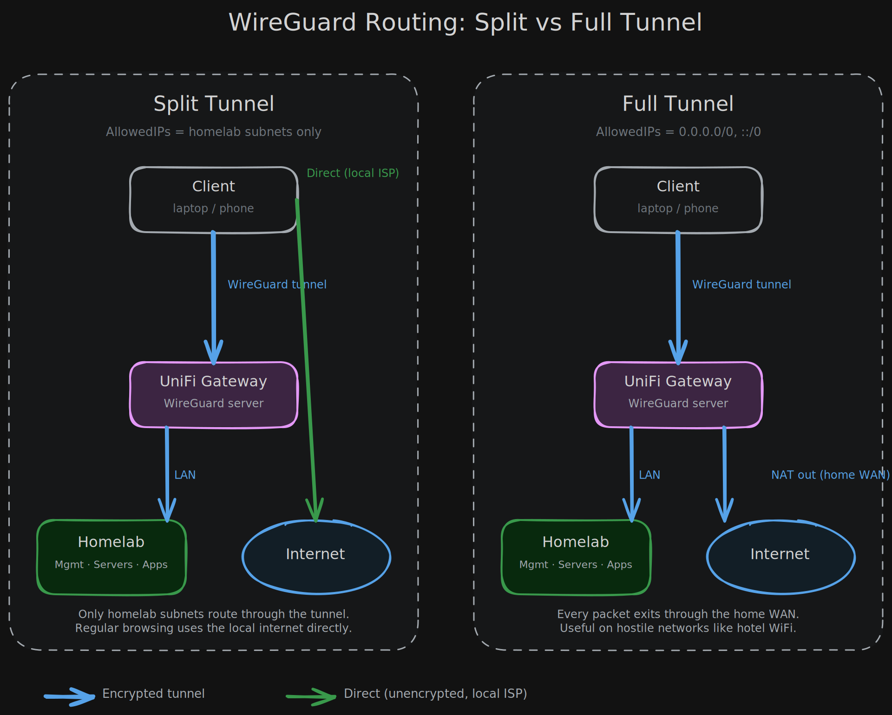

# Netwerk

🇬🇧 [English](README.md) | 🇳🇱 Nederlands

Documentatie van de netwerklaag van de homelab. Gebouwd op drie principes: segmenteer op doel, deny by default, verifieer wat je toestaat.

## Inhoud

| Document | Onderwerp |
|----------|-----------|
| [01-architecture.nl.md](01-architecture.nl.md) | Hardware, fysieke topologie, ontwerpprincipes |
| [02-vlan-segmentation.nl.md](02-vlan-segmentation.nl.md) | VLAN-indeling, subnets, DHCP-ranges, switchport-profielen |
| [03-zone-firewall.nl.md](03-zone-firewall.nl.md) | Zone-based firewall, custom zones, allow-regels |
| [04-wireguard-vpn.nl.md](04-wireguard-vpn.nl.md) | WireGuard server, DDNS, split versus full tunnel |
| [05-cybersecurity-hardening.nl.md](05-cybersecurity-hardening.nl.md) | IPS, GeoIP, versleutelde DNS, WiFi hardening |

## Diagrammen

Bronbestanden en SVG-exports staan in [diagrams/](diagrams/).

### Topologie

### Zone-based firewall matrix

### WireGuard routing: split vs full tunnel

De bronbestanden (`.excalidraw`) zijn te openen en te bewerken op [excalidraw.com](https://excalidraw.com).
